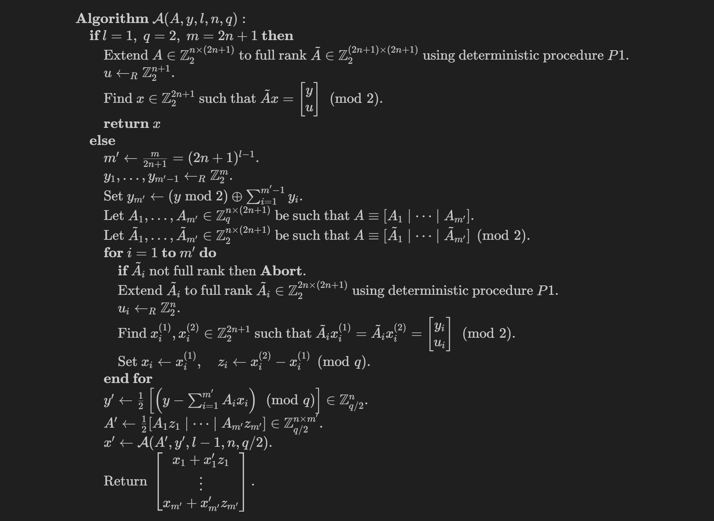

# ISIS solver

This is an implementation of the following algorithm which solves the subset-sum problem in the group $\mathbb{Z}_q^n$ for $q=2^l$ and $m=(2n+1)^l$ in time $O(n^2m)=2^{O(\log n\log q)}$, with aborting probability $\mathrm{negl}(n)$ if $A$ and $y$ are randomly chosen. This algorithm uses $m-nl$ random bits, and is randomness recoverable.

<!-- $$
\begin{array}{l}
\mathbf{Algorithm}\ \mathcal{A}(A, y, l, n,q): \\
\quad \textbf{if } l = 1,\;q=2,\;m=2n+1 \textbf{ then} \\
\quad\quad\text{Extend } A\in\mathbb{Z}_2^{n\times (2n+1)} \text{ to full rank } \tilde{A} \in \mathbb{Z}_2^{(2n+1) \times (2n+1)} \text{ using deterministic procedure } P1.\\
\quad \quad u \leftarrow_R \mathbb{Z}_2^{n+1}. \\
\quad \quad \text{Find } x \in \mathbb{Z}_2^{2n+1} \text{ such that } \tilde{A}x= \left[\begin{matrix}y\\u\end{matrix}\right] \pmod{2}. \\
\quad \quad \textbf{return } x\\
\quad \textbf{else} \\
\quad \quad m' \leftarrow \frac{m}{2n+1} = (2n+1)^{l-1}. \\
\quad \quad y_1, \ldots, y_{m'-1} \leftarrow_R \mathbb{Z}_2^m. \\
\quad \quad \text{Set } y_{m'} \leftarrow (y \bmod 2) \oplus \sum_{i=1}^{m'-1} y_i. \\
\quad \quad \text{Let } A_1, \ldots, A_{m'} \in \mathbb{Z}_q^{n \times (2n+1)} \text{ be such that } A \equiv [{A}_1 \mid \cdots \mid {A}_{m'}]. \\
\quad \quad \text{Let } \tilde{A}_1, \ldots, \tilde{A}_{m'} \in \mathbb{Z}_2^{n \times (2n+1)} \text{ be such that } A \equiv [\tilde{A}_1 \mid \cdots \mid \tilde{A}_{m'}] \pmod{2}. \\
\quad \quad \textbf{for } i = 1 \textbf{ to } m' \textbf{ do} \\
\quad\quad\quad \textbf{if } \tilde{A}_i \text{ not full rank then \textbf{Abort}.}\\
\quad\quad\quad\text{Extend } \tilde{A}_i \text{ to full rank } \tilde{A}_i \in \mathbb{Z}_2^{2n \times (2n+1)} \text{ using deterministic procedure } P1. \\
\quad \quad \quad u_i \leftarrow_R \mathbb{Z}_2^n . \\
\quad \quad \quad \text{Find } x_i^{(1)}, x_i^{(2)} \in \mathbb{Z}_2^{2n+1} \text{ such that } \tilde{A}_i x_i^{(1)} = \tilde{A}_i x_i^{(2)} = \left[\begin{matrix}y_i\\u_i\end{matrix}\right] \pmod{2}. \\
\quad \quad \quad \text{Set } x_i \leftarrow x_i^{(1)},\quad z_i \leftarrow x_i^{(2)} - x_i^{(1)} \pmod{q}. \\
\quad \quad \textbf{end for} \\
\quad \quad y' \leftarrow \frac{1}{2}\left[\left(y-\sum_{i=1}^{m'}A_ix_i\right)\pmod{q}\right] \in \mathbb{Z}_{q/2}^n. \\
\quad \quad A' \leftarrow \frac{1}{2}[A_1z_1 \mid \cdots \mid A_{m'}z_{m'}] \in \mathbb{Z}_{q/2}^{n \times m'}. \\
\quad \quad x' \leftarrow \mathcal{A}(A', y', l-1, n, q/2). \\
\quad \quad \text{Return } \left[\begin{matrix}x_1+x'_1z_1\\\vdots\\x_{m'}+x'_{m'}z_{m'}\end{matrix}\right]. \\
\end{array}
$$ -->

The procedure $P1$ is a deterministic procedure that extends a full row-rank matrix $A\in\mathbb{Z}_2^{r\times m}$ to another full row-rank matrix $\tilde{A}\in\mathbb{Z}_2^{n\times m}$ by adding $n-r$ rows of unit vectors to $A$.

The algorithm is revised from the paper [[CH25]](https://eprint.iacr.org/2025/1857.pdf).
